# DevMind AI — Frontend ↔ Backend Working Flow

> Verified against the current source (`client/src`, `server/src`). Diagrams are Mermaid —
> they render on GitHub and in VS Code (Markdown Preview Mermaid Support).

---

## 1. System Overview

```
┌──────────────────────────── BROWSER (client/) ────────────────────────────┐
│  React 19 · Vite 6 · Tailwind · Zustand (client state)                     │
│  TanStack React Query (server state) · React Router 7                      │
│  Axios (REST + JWT refresh) · socket.io-client (live notifications)        │
└───────────────┬──────────────────────────────────────┬────────────────────┘
                │ REST  /api/v1/*  (Bearer JWT)        │ WebSocket (JWT in handshake)
                ▼                                      ▼
┌──────────────────────────── SERVER (server/) ─────────────────────────────┐
│  Express 4 · TypeScript · helmet/cors/rate-limit/compression                │
│  Middleware chain → Routes → Controllers → Services → Models               │
│  Domain modules: indexer · repo-intelligence · code-review · doc-generator │
│  Socket.io (rooms: user:<userId>)                                          │
└──────┬──────────────────┬──────────────────┬───────────────────────────────┘
       ▼                  ▼                  ▼
 ┌───────────┐   ┌────────────────┐   ┌──────────────────────────────┐
 │  MongoDB  │   │  GitHub API    │   │ AI providers                 │
 │ (Mongoose)│   │  (Octokit +    │   │ Groq · Gemini (auto-fallback)│
 │           │   │   OAuth token) │   │ Cloudinary · Nodemailer      │
 └───────────┘   └────────────────┘   └──────────────────────────────┘
```

**Rule of thumb:** the client never talks to MongoDB, GitHub, or AI providers directly.
Everything goes through the Express API, which owns all secrets and business rules.

---

## 2. Boot Flow (what starts when you run `npm run dev`)

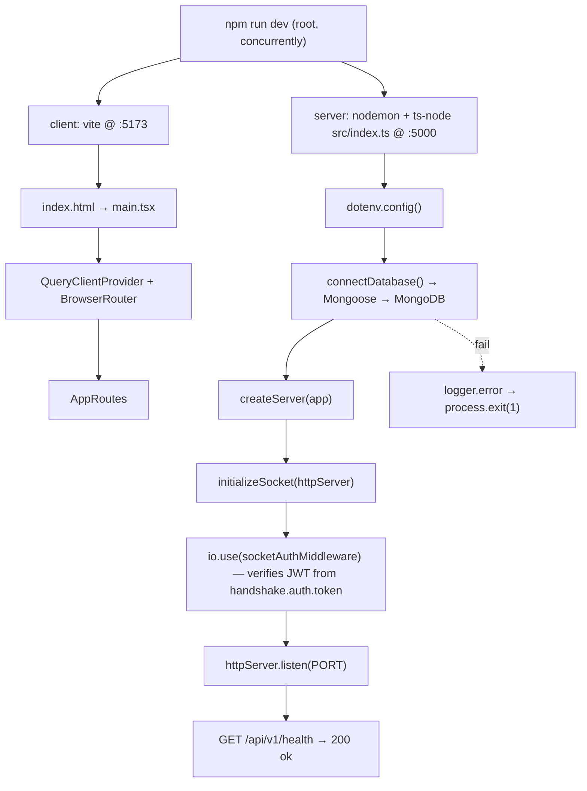

Client env: `VITE_API_URL` (default `/api/v1`), `VITE_SOCKET_URL` (default same origin).
Server env: `JWT_SECRET` + `JWT_REFRESH_SECRET` are **required** or boot throws.

---

## 3. Frontend Request Path (client → server)

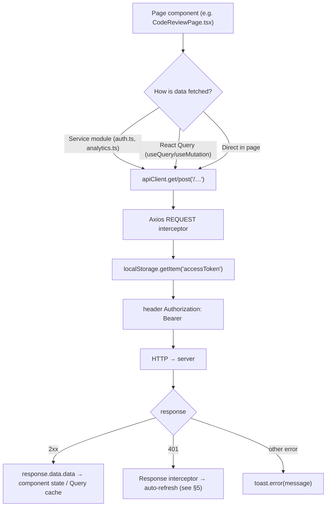

**Why services exist:** `client/src/services/*` and page-level calls both use the single
`apiClient` instance, so every request automatically gets the token, the refresh logic,
the 180s timeout, and `withCredentials` (needed for the httpOnly refresh cookie).

**Client vs server state**
| State | Tool | Examples |
|---|---|---|
| Auth session, UI flags | Zustand | `store/auth`, `store/ui` |
| Fetched API data | TanStack React Query | analytics, review history (`staleTime` 5 min, `retry: 1`) |
| Route protection | `AuthGuard` | wraps `/dashboard`, `/github`, `/ai/*`, `/analytics` |

**Route map** (`client/src/routes/index.tsx`)

```
PUBLIC                                    GUARDED (AuthGuard + AppLayout)
/auth/login                               /            → redirect /dashboard
/auth/register                            /dashboard
/auth/forgot-password                     /github
/auth/reset-password/:token               /ai/chat
/auth/verify-email/:token                 /ai/code-review
/auth/github/callback  (OAuth popup)      /ai/docs
/code-review/shared/:token  (share link)  /analytics
*  → /auth/login
```

---

## 4. Backend Request Path (server internals)

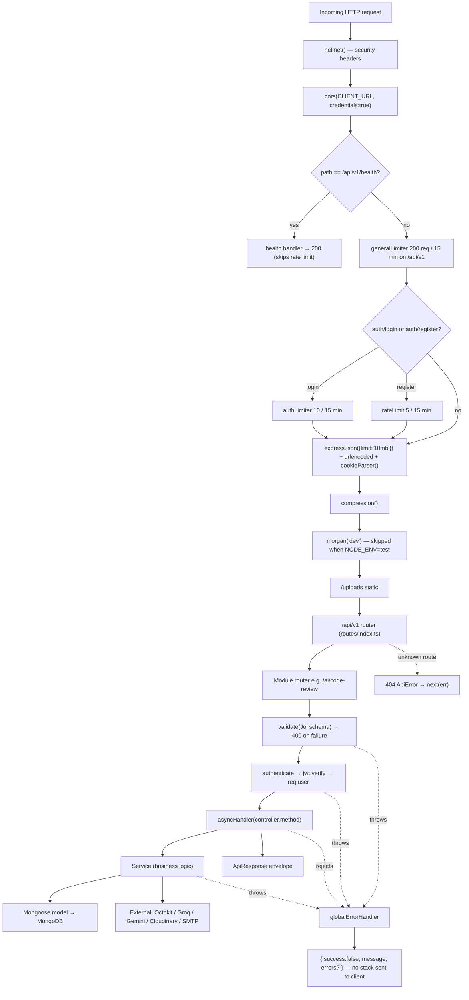

Note: a public route must be registered **before** `authenticate` in its own router
(e.g. `GET /ai/code-review/shared/:token`, `GET /github/callback`).

**Standard response envelope** (`utils/apiResponse.ts`)

```jsonc
// success
{ "success": true, "message": "...", "data": { … }, "meta": { … } }
// error
{ "success": false, "message": "..." }   // + errors when applicable
```

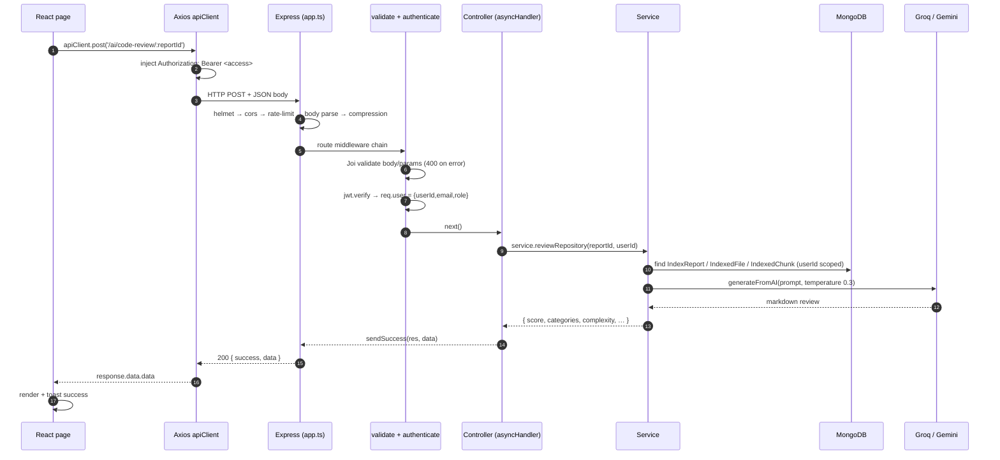

---

## 5. Auth & Token Refresh Flow

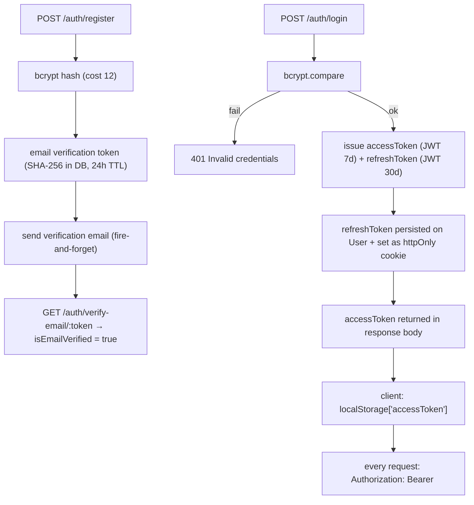

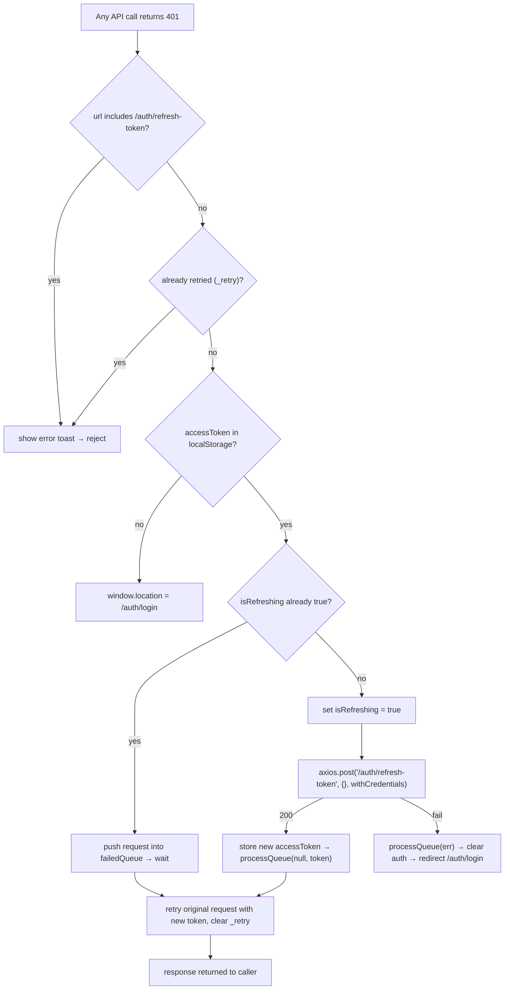

Server side: `POST /auth/refresh-token` verifies with `JWT_REFRESH_SECRET`, **rotates** the
refresh token, and detects reuse (mismatch ⇒ all sessions invalidated).

| Concern | Where |
|---|---|
| Password hashing | `bcryptjs`, cost 12 |
| Access token | JWT, `JWT_EXPIRES_IN=7d`, in `localStorage` |
| Refresh token | JWT, 30d, httpOnly cookie + `User.refreshToken` (`select: false`) |
| Socket auth | same access token in `handshake.auth.token` |
| Role gating | `authorize(...roles)` middleware |

---

## 6. GitHub OAuth Connect Flow (popup)

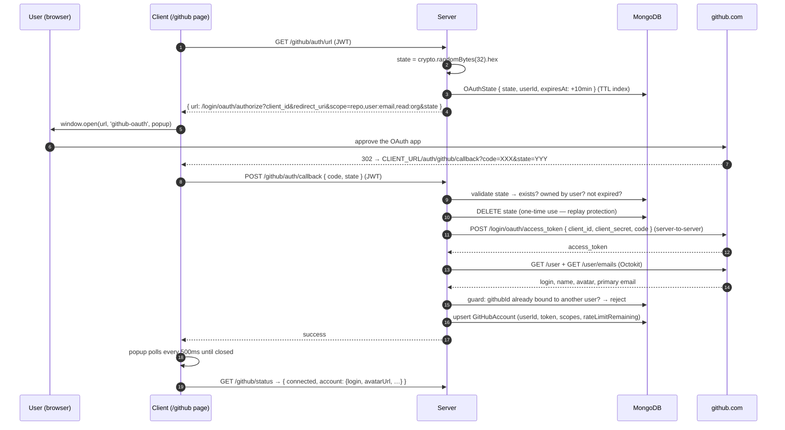

The browser **never** sees the GitHub access token — the exchange happens server-side.
`GET /github/callback` (unauthenticated, registered first) is the non-popup fallback and
302-redirects to `CLIENT_URL/github?github_status=success|error`.

Disconnect (`POST /github/disconnect`) soft-disconnects and cascade-deletes the user's
`ImportedRepository`, `IndexReport`, `IndexedFile`, `IndexedChunk`.

---

## 7. Repository Import + Indexing Pipeline

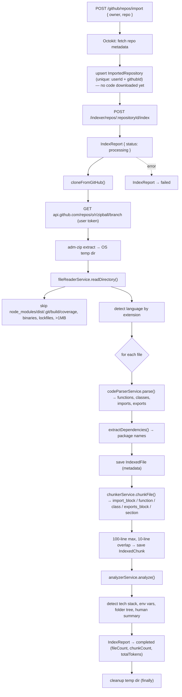

Statuses: `pending → processing → completed | failed`. Every query is scoped by `userId`.

---

## 8. Feature Flows (server-side logic)

### 8a. Repo Intelligence — "ask a question about the code" (RAG)

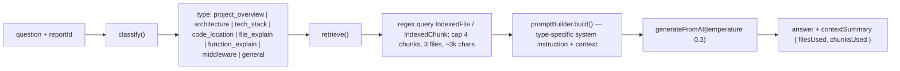

No embeddings / vector search — retrieval is rule-based classification + regex.

### 8b. AI Code Review (static analysis + LLM)

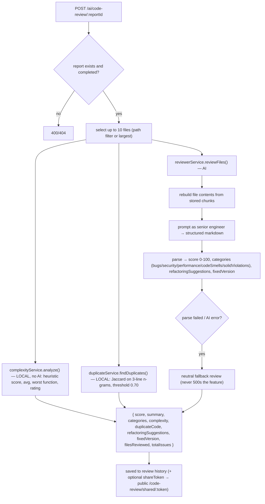

### 8c. Doc Generator

```
POST /ai/doc-generator/:reportId/generate { docType }
  → 9 types: readme · installation · folder-structure · architecture · api-docs
             env-vars · deployment · contributing · license
  → build context: summary, techStack, folderStructure, language counts, top files,
                   routes, functions, classes, envVars, dependencies, code samples
  → generatorService.generate(type, context) → { content, documentType, fileName }
```

### 8d. AI Chat

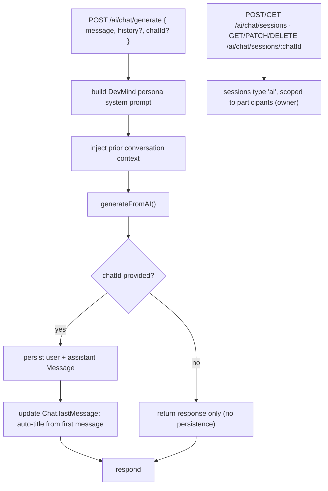

### 8e. AI Provider Selection (important + often misstated)

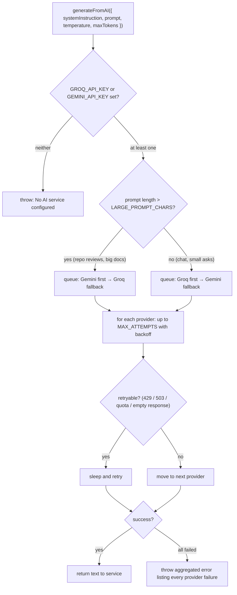

> Note: the README simplifies this as "Groq first, Gemini fallback". The actual code prefers
> **Gemini for large prompts** and **Groq for small prompts**, always keeping the other as fallback.

---

## 9. Real-time (Socket.io)

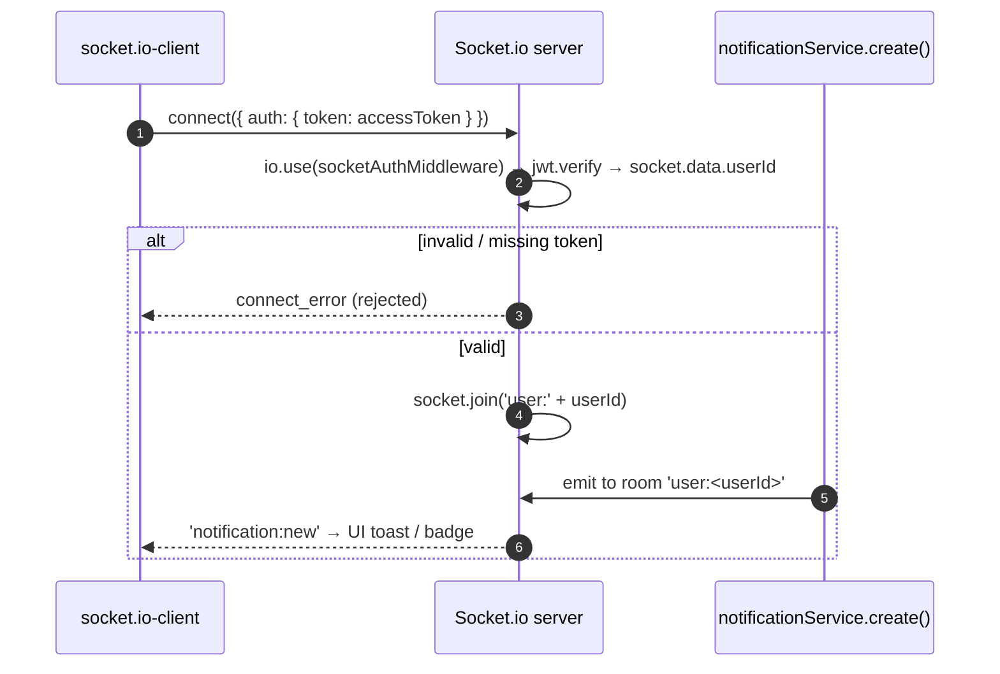

Client helper (`client/src/services/socket.ts`): `connectSocket()` (reuses an existing socket),
`onNotificationNew(cb)`, `onAnalyticsUpdate(cb)`, `disconnectSocket()`.
Reconnection: 10 attempts, 1s → 5s backoff, transports `websocket` then `polling`.

---

## 10. End-to-End User Journey (everything combined)

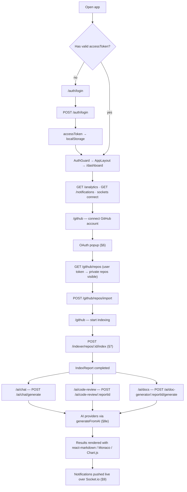

---

## 11. API Surface (base `/api/v1`)

| Module | Endpoints |
|---|---|
| Auth | `POST /auth/register` · `/auth/login` · `/auth/logout` · `/auth/refresh-token` · `PATCH /auth/change-password` · `POST /auth/forgot-password` · `/auth/reset-password` · `GET /auth/verify-email/:token` |
| GitHub | `GET /github/callback` *(public)* · `GET /github/auth/url` · `POST /github/auth/callback` · `/github/disconnect` · `/github/force-disconnect` · `GET /github/status` · `/github/repos` · `/github/repos/imported` · `POST /github/repos/import` · `DELETE /github/repos/imported/:id` · `POST /github/repos/sync` · `GET /github/repos/:owner/:repo` (+ `/branches`, `/commits`, `/pulls`, `/tree`) |
| Indexer | `POST /indexer/repos/:repositoryId/index` · `GET /indexer/reports/:reportId` (+ `/files`, `/files/:fileId`, `/chunks`) · `DELETE /indexer/reports/:reportId` |
| Repo Intelligence | `GET /ai/repo-intelligence/questions` · `/status` · `/reports` · `POST /ai/repo-intelligence/query` · `/ai/repo-intelligence/:reportId/ask` |
| Code Review | `POST /ai/code-review/review` · `/ai/code-review/:reportId` · `GET /ai/code-review/shared/:token` *(public)* · history routes |
| Doc Generator | `GET /ai/doc-generator/types` · `POST /ai/doc-generator/generate` · `/ai/doc-generator/:reportId/generate` |
| Chat | `POST/GET /ai/chat/sessions` · `GET/PATCH/DELETE /ai/chat/sessions/:chatId` · `POST /ai/chat/generate` |
| Analytics / Upload / Health | `GET /analytics` · `POST /upload/single` · `/upload/multiple` · `DELETE /upload/delete` · `GET /health`, `/health/ping` |

---

## 12. Data Models (MongoDB)

| Collection | Purpose | Key fields / indexes |
|---|---|---|
| `User` | Accounts | unique email/username, bcrypt password, role, verification/reset tokens (TTL), `refreshToken` |
| `Chat` / `Message` | AI chat | `type`, `participants[]`, `role`, `type` |
| `GitHubAccount` | OAuth identity | `userId` unique, `githubId`, `accessToken`, `scopes`, `isConnected`, rate-limit tracking |
| `OAuthState` | OAuth CSRF state | unique `state`, TTL index (10 min) |
| `ImportedRepository` | Saved repos | unique `(userId, githubId)`, `fullName`, stars/forks, permissions |
| `IndexReport` | One per index run | `status`, `summary`, `techStack`, `folderStructure`, counts |
| `IndexedFile` | File metadata | unique `(reportId, path)`, functions/classes/imports/exports/dependencies |
| `IndexedChunk` | Code fragments | `(reportId, fileId, index)`, `content`, `type`, `tokenCount` |
| `Notification` / `Upload` | Alerts & uploads | — |

All models serialize `id` (string) instead of `_id`/`__v`, and strip secrets
(`password`, `refreshToken`, `accessToken`, verification tokens).

---

## 13. Security Checklist (mapped to code)

| Concern | Implementation |
|---|---|
| Headers | `helmet()` in `app.ts` |
| CORS | whitelisted `CLIENT_URL`, `credentials: true` |
| Rate limits | global 200/15min · login 10/15min · register 5/15min |
| Validation | Joi `validate()` before controllers |
| Auth | `authenticate` verifies JWT; `authorize(...roles)` for RBAC |
| Errors | `globalErrorHandler` — stack traces logged server-side, never returned |
| OAuth CSRF | random `state`, bound to user, one-time use, 10-min TTL |
| Data isolation | every query filtered by `userId`; socket rooms per user |
| Body limits | 10 MB JSON / url-encoded |
| Deploy | `render.yaml`: API service (`/api/v1/health`) + static SPA with `/index.html` rewrite |
