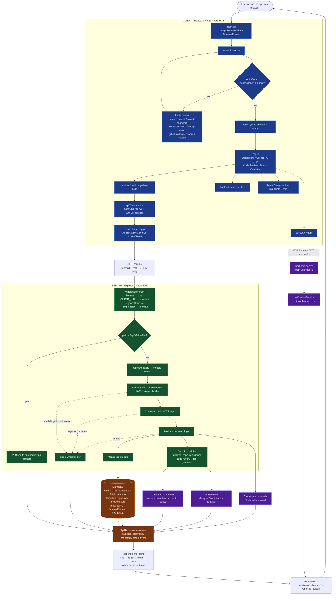
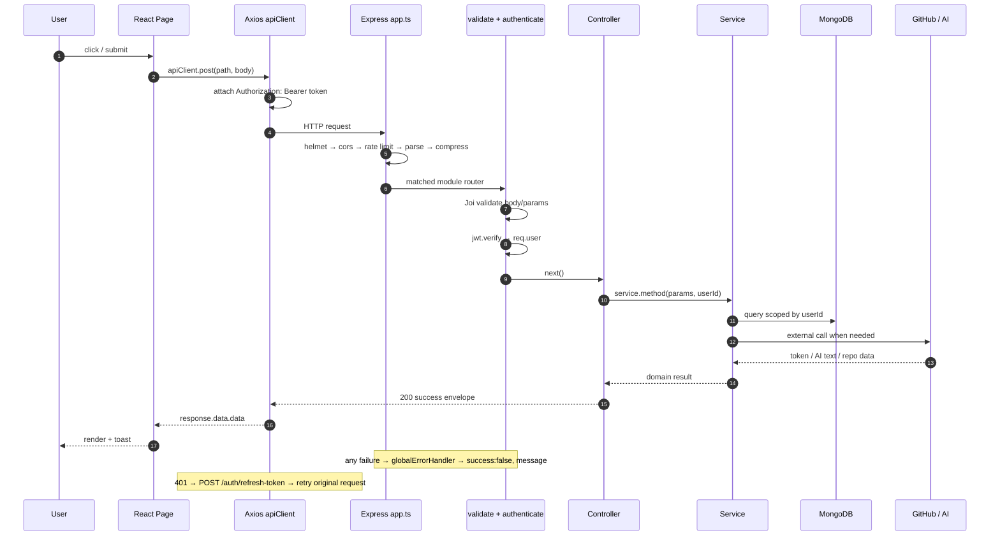

# DevMind AI — Master Project Flowchart

One consolidated chart of how the whole project works, traced from the real source
(`client/src`, `server/src`, `server/src/app.ts`, `server/src/routes/index.ts`).

---

## Master Flow (end to end)



---

## Request Lifecycle (sequence view)



---

## Plain-text version (for terminals / no renderer)

```
USER
 └─> CLIENT (React 19 + Vite, :5173)
      main.tsx -> Router -> AuthGuard -> Pages
        Pages -> services/page calls
              -> apiClient (axios) -> request interceptor adds Bearer token
              -> Zustand (auth/ui)  -> React Query (server cache)
              -> socket.io-client (live notifications)
 └─> NETWORK  HTTP /api/v1  +  WebSocket (JWT handshake)
 └─> SERVER (Express 4, :5000)
      helmet -> cors -> rate-limit -> json(10mb) -> compression -> morgan
        -> /api/v1/health  (short-circuits)
        -> routes/index.ts -> module router
             -> validate(Joi) -> authenticate(JWT) -> asyncHandler(controller)
                  -> controller (thin)
                  -> service (business logic)
                       -> domain modules: indexer / repo-intelligence /
                                          code-review / doc-generator
                       -> Mongoose models
                  -> success envelope { success, message, data }
             -> globalErrorHandler { success:false, message }
 └─> DATA & EXTERNAL
      MongoDB: User, Chat, Message, GitHubAccount, ImportedRepository,
               IndexReport, IndexedFile, IndexedChunk, OAuthState
      GitHub (Octokit)   AI: Groq <-> Gemini   Cloudinary   Nodemailer
 └─> RESPONSE back up the same path (401 -> refresh -> retry)
 └─> REALTIME: Socket.io room user:<userId> pushes notification:new
```

---

## How to read it

| Band | Meaning |
|---|---|
| **CLIENT** | Everything that runs in the browser. Only ever speaks HTTP + WebSocket. |
| **SERVER** | The only component holding secrets. Layer order is fixed: middleware → route → controller → service → model. |
| **DATA** | MongoDB collections; every query is scoped by `userId`. |
| **EXTERNAL** | Third-party systems the server calls on the user's behalf. |
